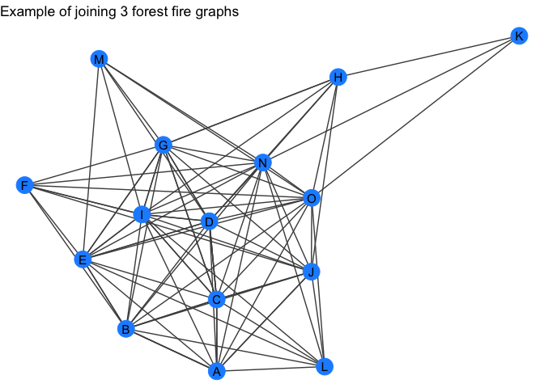

<!-- README.md is generated from README.Rmd. Please edit that file -->
jhcutils <a href="https://jhrcook.github.io/jhcutils/index.html">  </a>
==========================================================================================================================================

[](https://www.gnu.org/licenses/gpl-3.0) [](https://travis-ci.org/jhrcook/jhcutils) [](https://ci.appveyor.com/project/jhrcook/jhcutils) [](https://codecov.io/github/jhrcook/jhcutils?branch=master)

These are a bunch of functions that I find myself declaring and rewriting in a many scripts and analyses.

Installation
------------

You can install 'jhcutils' with:

``` r
devtools::install_github("jhrcook/jhcutils")
```

Full documentation: ['pkgdown site'](https://jhrcook.github.io/jhcutils/index.html)

------------------------------------------------------------------------

General Utilities
-----------------

**n\_unique** - return the number of unique values in a vector.

``` r
a <- c(1, 2, 2, 3, 4, 5)
n_unique(a)
#> [1] 5
b <- list(c(1, 2, 3, 4), c(1, 2, 3, 4, 5))
n_unique(b)
#> [1] 2
n_unique(b, to_unlist = TRUE)
#> [1] 5
```

**unique\_na** - return the unique values in a vector, omitting `NA`.

``` r
a <- c(1, 2, 3, NA, 3)
unique_na(a)
#> [1] 1 2 3
b <- list(c(1, 2, 3, NA), c(1, 2, NA, 5))
unique_na(b)
#> [[1]]
#> [1]  1  2  3 NA
#> 
#> [[2]]
#> [1]  1  2 NA  5
unique_na(b, to_unlist = TRUE)
#> [1] 1 2 3 5
```

Tidygraph
---------

**quick\_forestfire** - wrapper around `tidygraph::play_forestfire` except that it will return a tidygraph object with the node attribute `"name"`.

``` r
forest_gr <- quick_forestfire(10)
forest_gr
#> # A tbl_graph: 10 nodes and 23 edges
#> #
#> # An undirected simple graph with 1 component
#> #
#> # Node Data: 10 x 1 (active)
#>   name 
#>   <chr>
#> 1 A    
#> 2 B    
#> 3 C    
#> 4 D    
#> 5 E    
#> 6 F    
#> # … with 4 more rows
#> #
#> # Edge Data: 23 x 2
#>    from    to
#>   <int> <int>
#> 1     1     2
#> 2     1     3
#> 3     2     3
#> # … with 20 more rows
my_plot_fxn(forest_gr) +
    labs(title = "Example of a quick Forest Fire graph model")
```


**quick\_barabasi** - wrapper around `tidygraph::play_barabasi_albert` except that it will return a tidygraph object with the node attribute `"name"`.

``` r
barabasi_gr <- quick_barabasi(10)
barabasi_gr
#> # A tbl_graph: 10 nodes and 9 edges
#> #
#> # An undirected simple graph with 1 component
#> #
#> # Node Data: 10 x 1 (active)
#>   name 
#>   <chr>
#> 1 A    
#> 2 B    
#> 3 C    
#> 4 D    
#> 5 E    
#> 6 F    
#> # … with 4 more rows
#> #
#> # Edge Data: 9 x 2
#>    from    to
#>   <int> <int>
#> 1     1     2
#> 2     1     3
#> 3     2     4
#> # … with 6 more rows
my_plot_fxn(barabasi_gr) +
    labs(title = "Example of a quick Barabasi-Albert graph")
```


**quick\_graph** - randomly selects one of the above random graphs

``` r
quick_gr <- quick_graph(10)
#> using forestfire
```

**recursive\_graph\_join** - recursively join a list of tidygraph objects

``` r
gr_list <- purrr::map(c(5, 10, 15), quick_forestfire)
gr <- recursive_graph_join(gr_list)
gr
#> # A tbl_graph: 15 nodes and 114 edges
#> #
#> # A directed acyclic multigraph with 1 component
#> #
#> # Node Data: 15 x 1 (active)
#>   name 
#>   <chr>
#> 1 A    
#> 2 B    
#> 3 C    
#> 4 D    
#> 5 E    
#> 6 F    
#> # … with 9 more rows
#> #
#> # Edge Data: 114 x 2
#>    from    to
#>   <int> <int>
#> 1     1     2
#> 2     2     3
#> 3     1     3
#> # … with 111 more rows
my_plot_fxn(gr) +
    labs(title = "Example of joining 3 forest fire graphs")
```



------------------------------------------------------------------------

Additions
---------

If you have any recommended additions, please open an [issue](https://github.com/jhrcook/jhcutils/issues).
