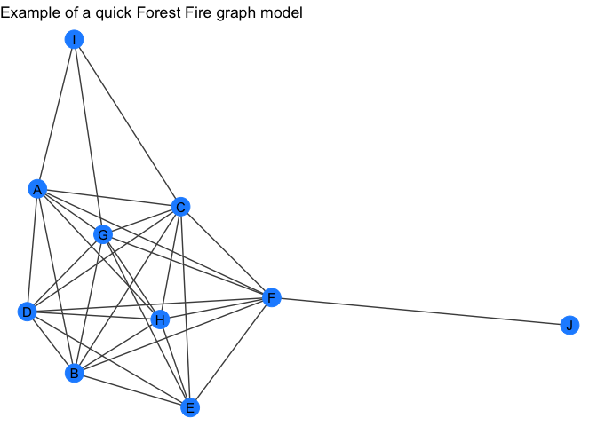
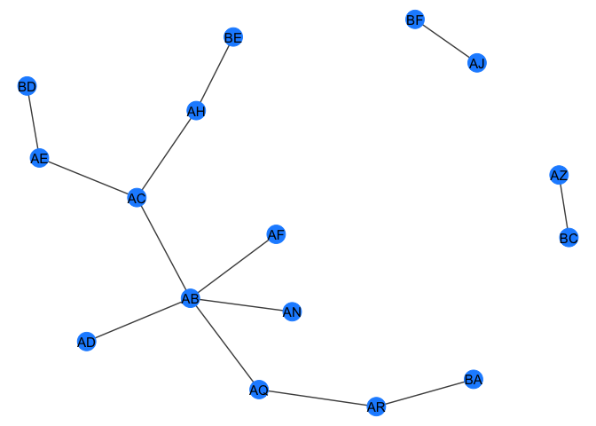

<!-- README.md is generated from README.Rmd. Please edit that file -->

jhcutils 
==========================================================================================================================================

  

These are a bunch of functions that I find myself declaring and
rewriting in a many scripts and analyses.

Full documentation at the [‘pkgdown
site’](https://jhrcook.github.io/jhcutils/index.html).

Installation
------------

You can install ‘jhcutils’ with:

    devtools::install_github("jhrcook/jhcutils")

    library(jhcutils)
    library(datasets)
    library(tidygraph)
    library(dplyr)
    set.seed(0)

### Additions

If you have any recommended additions, please open an
[issue](https://github.com/jhrcook/jhcutils/issues).

------------------------------------------------------------------------

General Utilities
-----------------

`n_unique` - return the number of unique values in a vector.

`unique_na` - return the unique values in a vector, omitting `NA`.

    a <- c(1, 2, 3, NA, 3)
    unique_na(a)
    #> [1] 1 2 3
    b <- list(c(1, 2, 3, NA), c(1, 2, NA, 5))
    unique_na(b)
    #> [[1]]
    #> [1]  1  2  3 NA
    #> 
    #> [[2]]
    #> [1]  1  2 NA  5
    unique_na(b, to_unlist = TRUE)
    #> [1] 1 2 3 5

`minmax` - set limits on a vector of numeric values.

    c <- sample(-100:100, 20)
    c
    #>  [1]  41 -33  66  28  61 -58 -87  86 -50 -16 -80   5  81 -27 -94 -28 -22 -64   4
    #> [20]   9
    minmax(c, -10, 10)
    #>  [1]  10 -10  10  10  10 -10 -10  10 -10 -10 -10   5  10 -10 -10 -10 -10 -10   4
    #> [20]   9

`u_pull` - works just like `dplyr::pull()` except only returns unique
values. There are also options to return the values sorted and without
`NA` using the paramters `sorted` and `na.rm`, respectively.

    str(mtcars$gear)
    #>  num [1:32] 4 4 4 3 3 3 3 4 4 4 ...
    mtcars %>% u_pull(gear)
    #> [1] 4 3 5

`vsample` - a safe wrapper for `base::sample()` that always assumes you
are passing a vector.

    # samples from 1:10
    sample(10)
    #>  [1]  5 10  2  8  6  1  4  3  9  7
    # just returns 10
    vsample(10)
    #> [1] 10

    # samples from 1:5 with replacement
    sample(5, 10, replace = TRUE)
    #>  [1] 3 2 2 4 4 4 2 4 1 1
    # samples from `c(5)` with replacement 
    vsample(5, 10, replace = TRUE)
    #>  [1] 5 5 5 5 5 5 5 5 5 5

`str_replace_us` and `str_replace_sp` - replace underscores with spaces,
or *vice vera*.

Tidygraph
---------

`quick_forestfire` and `quick_barabasi`- wrapper around
`tidygraph::play_forestfire` and `tidygraph::play_barabasi_albert`
except that it will return a tidygraph object with the node attribute
`"name"`.

    forest_gr <- quick_forestfire(10)
    forest_gr
    #> # A tbl_graph: 10 nodes and 31 edges
    #> #
    #> # An undirected simple graph with 1 component
    #> #
    #> # Node Data: 10 x 1 (active)
    #>   name 
    #>   <chr>
    #> 1 A    
    #> 2 B    
    #> 3 C    
    #> 4 D    
    #> 5 E    
    #> 6 F    
    #> # … with 4 more rows
    #> #
    #> # Edge Data: 31 x 2
    #>    from    to
    #>   <int> <int>
    #> 1     1     2
    #> 2     2     3
    #> 3     1     3
    #> # … with 28 more rows
    my_plot_fxn(forest_gr) +
        labs(title = "Example of a quick Forest Fire graph model")

    barabasi_gr <- quick_barabasi(10)
    barabasi_gr
    #> # A tbl_graph: 10 nodes and 9 edges
    #> #
    #> # An unrooted tree
    #> #
    #> # Node Data: 10 x 1 (active)
    #>   name 
    #>   <chr>
    #> 1 A    
    #> 2 B    
    #> 3 C    
    #> 4 D    
    #> 5 E    
    #> 6 F    
    #> # … with 4 more rows
    #> #
    #> # Edge Data: 9 x 2
    #>    from    to
    #>   <int> <int>
    #> 1     1     2
    #> 2     1     3
    #> 3     2     4
    #> # … with 6 more rows
    my_plot_fxn(barabasi_gr) +
        labs(title = "Example of a quick Barabasi-Albert graph")

`quick_graph` - randomly selects one of the above random graphs.

`recursive_graph_join` - recursively join a list of tidygraph objects.

    gr_list <- purrr::map(c(5, 10, 15), quick_forestfire)
    gr <- recursive_graph_join(gr_list)
    gr
    #> # A tbl_graph: 15 nodes and 93 edges
    #> #
    #> # A directed acyclic multigraph with 1 component
    #> #
    #> # Node Data: 15 x 1 (active)
    #>   name 
    #>   <chr>
    #> 1 A    
    #> 2 B    
    #> 3 C    
    #> 4 D    
    #> 5 E    
    #> 6 F    
    #> # … with 9 more rows
    #> #
    #> # Edge Data: 93 x 2
    #>    from    to
    #>   <int> <int>
    #> 1     1     2
    #> 2     1     3
    #> 3     2     3
    #> # … with 90 more rows
    my_plot_fxn(gr) +
        labs(title = "Example of joining 3 forest fire graphs")

`filter_component_size` - filter the components of a tidygraph object by
their individual number of nodes (order).

    gr <- tidygraph::bind_graphs(quick_forestfire(4, name = LETTERS),
                                 quick_forestfire(6, name = letters))
    igraph::count_components(gr)
    #> [1] 2
    igraph::count_components(filter_component_size(gr, min_size = 5))
    #> [1] 1
    igraph::count_components(filter_component_size(gr, max_size = 5))
    #> [1] 1

`get/rm_giant_component` - either return only or everything except the
giant component of a graph (i.e. the component with the most number of
nodes).

    gr_large <- quick_forestfire(10, name = LETTERS)
    gr_small <- quick_forestfire(5, name = letters)
    gr <- tidygraph::bind_graphs(gr_large, gr_small)
    gr
    #> # A tbl_graph: 15 nodes and 28 edges
    #> #
    #> # An undirected simple graph with 2 components
    #> #
    #> # Node Data: 15 x 1 (active)
    #>   name 
    #>   <chr>
    #> 1 A    
    #> 2 B    
    #> 3 C    
    #> 4 D    
    #> 5 E    
    #> 6 F    
    #> # … with 9 more rows
    #> #
    #> # Edge Data: 28 x 2
    #>    from    to
    #>   <int> <int>
    #> 1     1     2
    #> 2     2     3
    #> 3     1     3
    #> # … with 25 more rows
    get_giant_component(gr)
    #> # A tbl_graph: 10 nodes and 19 edges
    #> #
    #> # An undirected simple graph with 1 component
    #> #
    #> # Node Data: 10 x 1 (active)
    #>   name 
    #>   <chr>
    #> 1 A    
    #> 2 B    
    #> 3 C    
    #> 4 D    
    #> 5 E    
    #> 6 F    
    #> # … with 4 more rows
    #> #
    #> # Edge Data: 19 x 2
    #>    from    to
    #>   <int> <int>
    #> 1     1     2
    #> 2     2     3
    #> 3     1     3
    #> # … with 16 more rows
    rm_giant_component(gr)
    #> # A tbl_graph: 5 nodes and 9 edges
    #> #
    #> # An undirected simple graph with 1 component
    #> #
    #> # Node Data: 5 x 1 (active)
    #>   name 
    #>   <chr>
    #> 1 a    
    #> 2 b    
    #> 3 c    
    #> 4 d    
    #> 5 e    
    #> #
    #> # Edge Data: 9 x 2
    #>    from    to
    #>   <int> <int>
    #> 1     1     2
    #> 2     1     3
    #> 3     2     3
    #> # … with 6 more rows

`num_qual_neighbors` - to be used with `tidygraph::map_local_int()` to
count the number of neighbors that satisfy a logical expression that is
applied to the node attributes of the neighborhood.

    gr <- quick_barabasi(30)
    gr
    #> # A tbl_graph: 30 nodes and 29 edges
    #> #
    #> # An unrooted tree
    #> #
    #> # Node Data: 30 x 1 (active)
    #>   name 
    #>   <chr>
    #> 1 AB   
    #> 2 AC   
    #> 3 AD   
    #> 4 AE   
    #> 5 AF   
    #> 6 AG   
    #> # … with 24 more rows
    #> #
    #> # Edge Data: 29 x 2
    #>    from    to
    #>   <int> <int>
    #> 1     1     2
    #> 2     1     3
    #> 3     2     4
    #> # … with 26 more rows
    my_plot_fxn(gr)

    # number of neighbors with a "B" in their name
    B_gr <- gr %>%
       mutate(name_with_B = map_local_int(
           .f = num_qual_neighbors,
           lgl_filter = rlang::expr(stringr::str_detect(name, "B"))
       ))

    B_gr %N>%
       filter(name_with_B > 0) %>%
       my_plot_fxn()

`get_node_index` - returns the indices of the nodes that pass the
expression evaluted in ’dplyr::filter()\`.

    # simple equalities
    get_node_index(quick_barabasi(10), name == "B")
    #> [1] 2
    get_node_index(quick_barabasi(10), name %in% c("B", "C", "D"))
    #> [1] 2 3 4
    # can also evaluate functions
    get_node_index(quick_barabasi(10), stringr::str_detect(name, "A|B|C"))
    #> [1] 1 2 3

Pacakge Utilities
-----------------

`document_df` - prints the framework for documenting a data frame
object.

    dat <- tibble::tibble(x = c(LETTERS[1:5]),
                          y = c(1:5),
                          z = list(rep(list(1:3), 5)))
    dat
    #> # A tibble: 5 x 3
    #>   x         y z         
    #>   <chr> <int> <list>    
    #> 1 A         1 <list [5]>
    #> 2 B         2 <list [5]>
    #> 3 C         3 <list [5]>
    #> 4 D         4 <list [5]>
    #> 5 E         5 <list [5]>
    document_df(dat)
    #> #' @format a tibble (5 x 3)
    #> #' \describe{
    #> #'     \item{x}{}
    #> #'     \item{y}{}
    #> #'     \item{z}{}
    #> #' }
